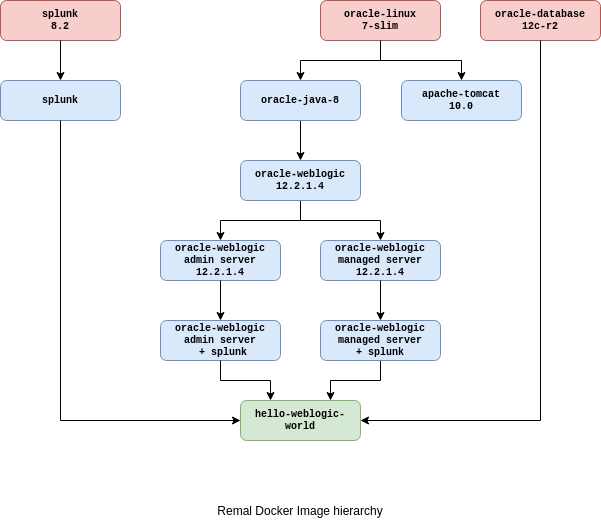

# Remal Docker Images

_keywords: automated deployment, docker, docker-compose, java, tomcat, weblogic_

## 1) Ready for use Remal Docker images
* Java Docker Images
  * [Oracle Java 8](/java/oracle-java-8)

* Apache-Tomcat Docker Images
  * [Apache Tomcat](/apache-tomcat/apache-tomcat-10.0)

* Database Docker Images
    * [Oracle Database Enterprise 12.2.0.1](/database/oracle-database-enterprise-12.2.0.1)

* Oracle Weblogic Docker Images
  * [Oracle Weblogic 12.2.1.4](/oracle-weblogic/oracle-weblogic-12.2.1.4)
  * [Oracle Weblogic 12.2.1.4 - administration server](/oracle-weblogic/oracle-weblogic-12.2.1.4-admin-server)
  * [Oracle Weblogic 12.2.1.4 - managed server](/oracle-weblogic/oracle-weblogic-12.2.1.4-managed-server)
  * [Hello WebLogic World: dockerization of a WebLogic application](/oracle-weblogic/hello-weblogic-world)

* Spluk Docker Images
    * [Splunk x.x server](/splunk/splunk-x.x)
    * [Oracle Weblogic administration server + Splunk forwarder](/splunk/oracle-weblogic-admin-server+splunk)
    * [Oracle Weblogic managed server + Splunk forwarder](/splunk/oracle-weblogic-managed-server+splunk)

## 2) Remal Docker image hierarchy
   

## 3) Contributing, improvements and bug report
* Do you like organizing?
* Do you like to code?
* Do you like helping people?
* Do you like helping others code?
* Do you like fixing bugs?

Then please
* Open an issue
* Open a pull request
* Contact with us

Contact: [arnold.somogyi@gmail.com](arnold.somogyi@gmail.com)

## 4) License
Before the build, you must download the `Oracle JDK` install kit from the Oracle website and accept the license indicated on that page.

Copyright (c) 2021 Remal Software, Arnold Somogyi. All rights reserved.

BSD (2-clause) licensed

## Appendix A) Docker cheat sheet
* Start Docker daemon on Centos: `sudo systemctl start docker`

* Login to Docker Image Registry: `docker -v login https://docker-registry.example.com/v2`

  
* Logging
  * Write log to file and screen: `docker logs -f <container-name> | tee output.log`
  * Show only errors and warnings: `docker-compose logs -f | grep -i 'error\|invalid'`

* Login to a container 
  * As an ordinary user: `docker exec -it <container-name> /bin/bash`
  * As root: `docker exec -it -u root -w /root <container-name> /bin/bash`

* Run the image without executing the default `CMD` command: `docker run -d --name <container-name> <image-name>:<image-version> tail -f /dev/null`

* Oracle Database in Docker
  * Run: `docker run -p 1521:1521 --network="host" --name oracle-db store/oracle/database-enterprise:12.2.0.1`
  * Port: `1521`
  * Sercive name: `ORCLPDB1.localdomain`
  * User: `SYS as SYSDBA`
  * Password: `Oradoc_db1`

* Container IP: `docker inspect -f '{{range .NetworkSettings.Networks}}{{.IPAddress}}{{end}}' <container-name>`

* Docker clean-up
  1. `docker info | grep "Docker Root Dir"`
  2. `du -h --max-depth=1 <root-dir>`
  3. `docker system df`
     1. Containers info: `docker container ls --filter "status=exited" -aq` 
     2. Clean-up docker containers: `docker container rm $(docker container ls --filter "status=exited" -aq)`
     3. Delete unused images: `docker rmi $(docker image ls -aq)` 
     4. Delete dangling images: `docker rmi $(docker image ls -aq --filter "dangling=true")`
     5. Clean-up docker volumes: `docker volume rm $(docker volume ls -q)`
     6. Cleanup docker networks: `docker network rm <NETWORK_ID>`
     7. Docker prune: `docker system prune --volumes`

## Appendix B) Useful Unix aliases
* `alias ll="ls -all"`
* `alias alias li="docker image ls | (sed -u 1q; sort -n -k1)"`
* `alias lc="docker container ls -a"`
* `alias cs='docker container stop $(docker container ls -a -q)'`
* `alias rmc='docker container rm $(docker container ls -a -q)'`
* `alias rmi='docker volume rm $(docker volume ls -qf dangling=true) ; docker rmi $(docker image ls -qf dangling=true)'`
