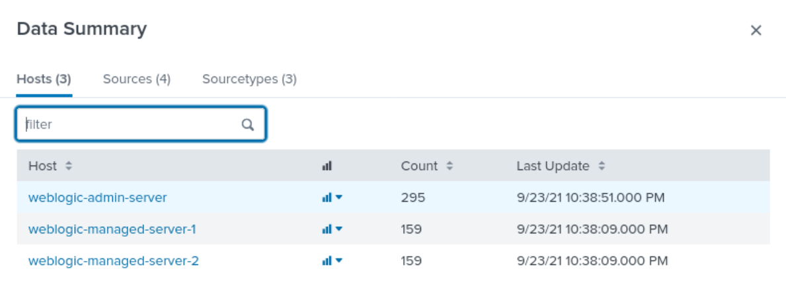
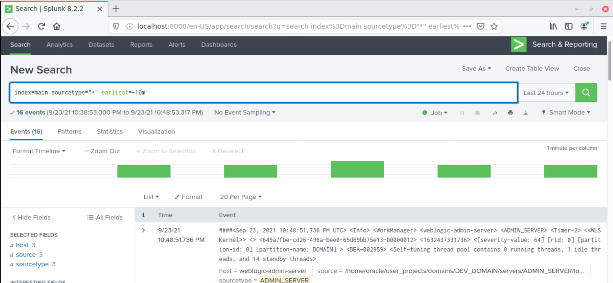

# Splunk 8.2 Docker Image

## 1) Image description
The image is based on the official _splunk:8.2_ image.
In this image the disk usage by the Splunk Indexer is limited to 200 MB.

* Figure 1: Splunk web console - hosts

* Figure 2: Splunk web console - incoming log entries
  

## 2) Build
Build it using:
~~~
$ cd splunk-8.2
$ ./build.sh
~~~

## 3) Usage
* Start the Splunk server: `docker-compose up`
* Splunk web console URL: [http://localhost:8000](http://localhost:8000)
* WebLogic credentials: `admin`/`password`

## 4) License
Before the build, you must download the `Oracle JDK` install kit from the Oracle website and accept the license indicated on that page.

Copyright (c) 2021 Remal Software, Arnold Somogyi. All rights reserved.

BSD (2-clause) licensed
